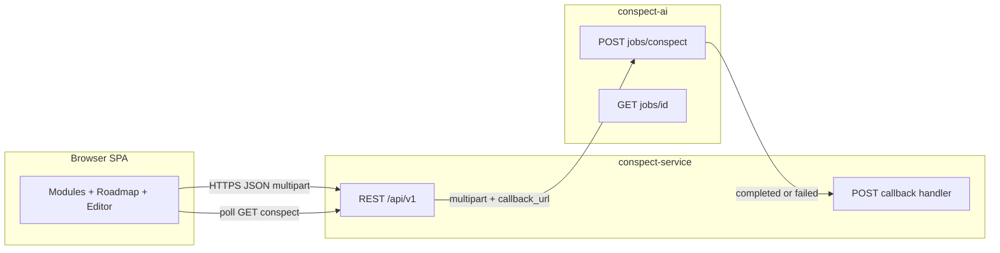
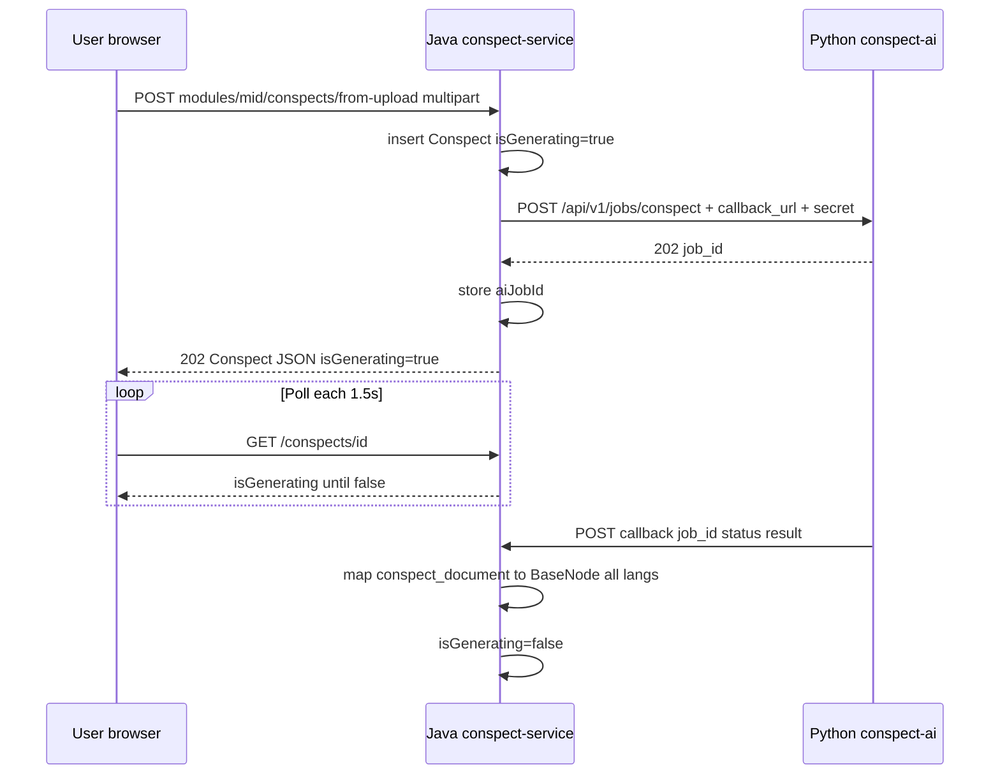
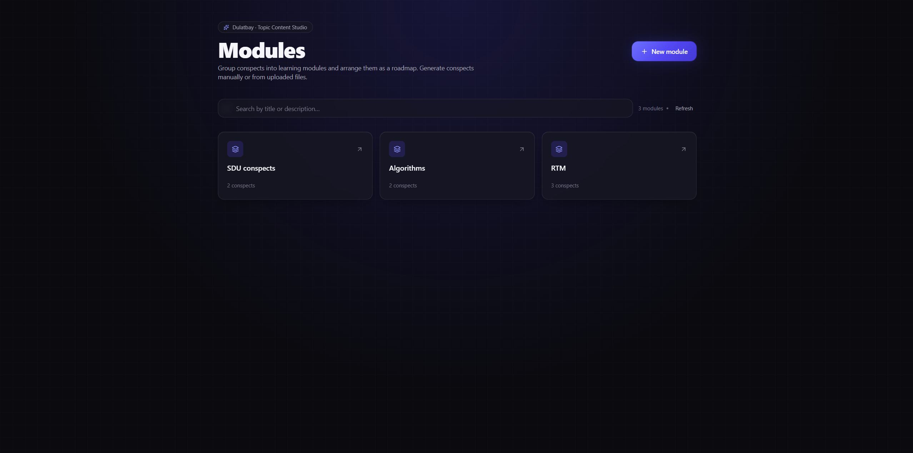
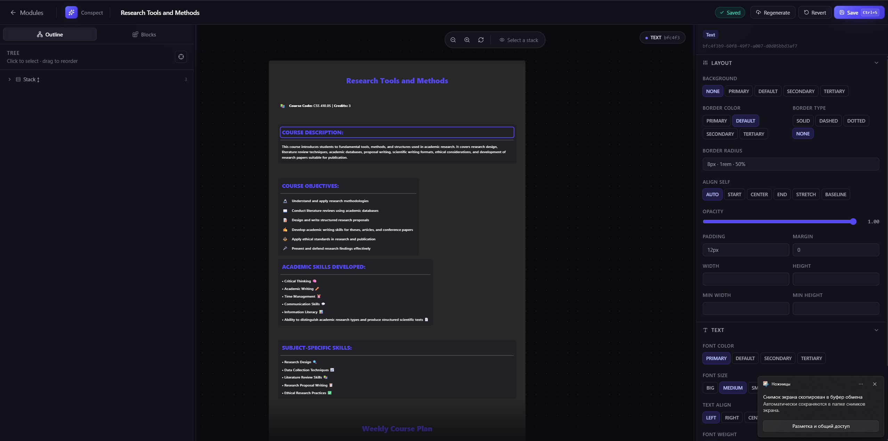

# Topic Content Studio — System Documentation for Research

**Product name:** Topic Content Studio (working name: *conspect-editor*)  
**Organization context:** Akhan Dulatbay — structured educational / topic content for medical and related curricula  
**Document purpose:** End-to-end description of the system suitable for a **research paper** (methods, architecture, data model, human–AI workflow, and visualization pipeline).

**Техническое углубление (ИИ, графы, wire-протоколы, Bedrock, нормализация JSON):** см. отдельный документ [**`RESEARCH_TECHNICAL_DEEP_DIVE_AI_AND_GRAPHS.md`**](./RESEARCH_TECHNICAL_DEEP_DIVE_AI_AND_GRAPHS.md).

---

## Abstract (paper-ready)

Topic Content Studio is a **web-based authoring environment** for *conspects* — hierarchical, block-structured lesson summaries represented as a **JSON document tree** with optional **explicit directed links** between nodes. The client provides a **spatial canvas** with pan/zoom, a **structural outline**, and property editing; edges between semantically related blocks are drawn as **SVG-based curves** (graph overlays) rather than only parent–child nesting. Content is grouped into **modules**; within each module, conspects form an ordered **roadmap** ( pedagogical sequence ). **Authoring** can be manual or **AI-assisted**: uploaded documents are processed by a Python service (LLM + document extractors), orchestrated by a Java API that persists state and exposes REST endpoints. The UI reflects **asynchronous generation** through `isGenerating` flags and **polling**, avoiding blocking HTTP during long-running inference.

---

## 1. Introduction and problem statement

### 1.1 Domain

Teachers and instructional designers often work from **heterogeneous source materials** (PDF, DOCX, slides, plain text) and need to turn them into **structured learning artifacts** that:

- Preserve a **clear reading order** (roadmap across lessons or sections).
- Allow **fine-grained layout** inside a single artifact (blocks, stacks, media).
- Optionally express **cross-references** (“this concept relates to that box”) as a **graph** on top of a tree.

### 1.2 Design goals

1. **Separation of concerns:** browser editor ↔ persistence / access control ↔ AI inference.
2. **Multi-language content:** conspect payloads support **Kazakh, Russian, English** parallel trees on the server; the editor can update one or all languages.
3. **Async AI:** generation must not freeze the UI; users see **explicit loading states** and **live status** until content is ready.
4. **Inspectable structure:** both **canvas** and **tree** views map to the same JSON model.

---

## 2. High-level architecture

The system comprises **three deployable components**:

| Layer | Technology | Role |
|--------|-------------|------|
| **SPA** | React 18, Vite, TypeScript, Redux Toolkit Query | Modules UI, roadmap, editor, uploads |
| **Content API** | Spring Boot 3, MongoDB | Modules, conspects CRUD, node operations, AI job linkage, callback ingestion |
| **AI worker** | FastAPI, Bedrock, extractors (PDF/VLM/OCR, DOCX, XLSX) | File → text → JSON conspect; optional HTTP callback |



**Figure (repository):** live UI captures are stored under [`docs/images/`](./images/) (see [`docs/images/README.md`](./images/README.md) for regeneration commands).

---

## 3. Information architecture: modules and roadmap

### 3.1 Module

A **module** is a pedagogical container:

- **Fields (conceptual):** `id`, `title`, `description`, `position`, soft-delete flag, audit timestamps.
- **API:** `GET/POST/PATCH/DELETE /api/v1/modules`, `PATCH .../reorder` with ordered `conspectIds`.

### 3.2 Roadmap

Within a module, **conspects** are ordered by an integer **`position`**. The UI renders a **vertical ordered list** (step numbers, drag-and-drop reorder). This is a **linear graph** (total order), not a free-form mind map — by design, to match “lesson sequence” narratives.

### 3.3 Conspect lifecycle

- **Created empty** inside a module → user opens editor when `isGenerating` is false.
- **Created from upload** → server sets `isGenerating=true`, stores `aiJobId`, optional `sourceFilename`; UI keeps user on the roadmap with **polling** until generation completes or fails.
- **Regenerate from file** on an existing conspect → content cleared, same async pattern.

---

## 4. Conspect document model (the “what we persist”)

### 4.1 Root and nodes

A conspect is a **single root `BaseNode`** (typically `nodeType: "STACK"`) whose **`children`** array forms a **tree**. Each node has:

- **`id`:** UUID string (client and server assign IDs; AI output is normalized server-side).
- **`nodeType`:** discriminator for polymorphic JSON (`STACK`, `TEXT`, `ICON_TEXT`, `TITLED_CONTAINER`, `CENTERED_CONTAINER`, `IMAGE`, `VIDEO`).
- **Layout / style tokens:** margin, padding, flex, borders, typography enums, etc. (see [`src/utills/parser/types.ts`](../src/utills/parser/types.ts)).
- **`links` (optional):** list of `{ fromId, toId }` edges where **`fromId` matches the current node** — used for **graph overlays**.

Server-side Java mirrors this with Jackson polymorphism on `BaseNode` aligned with the same `nodeType` property.

### 4.2 Why both tree and graph?

- **Tree (`children`):** nesting expresses **composition** (“inside this card, these blocks”).
- **Graph (`links`):** expresses **relational continuity** across branches (e.g. “definition ↔ example two columns away”) without forcing a single parent.

This dual representation is a strong **research contribution angle**: *structured document with optional semantic overlay edges*.

---

## 5. How we “draw” conspects and graphs (frontend rendering)

### 5.1 Recursive layout — `Parser`

[`src/utills/parser/Parser.tsx`](../src/utills/parser/Parser.tsx) walks the JSON tree:

- For each node type it picks a **React presentation component** (`StackNode`, `TextNode`, …).
- **`STACK`** nodes render **`children`** inside a flex container (vertical or horizontal per node flags).
- **`DraggableSibling`** wraps children to support **reordering within a stack** (drag-and-drop).

### 5.2 Graph edges — `react-archer`

The canvas wraps the tree in:

- **`ArcherContainer`** ([`MainDrawBar.tsx`](../src/components/MainDrawBar.tsx)) — global SVG layer for edges.
- **`ArcherElement`** per node (`Parser`) with stable **`id={node.id}`**.
- **`relations`** built from `node.links` where `link.fromId === obj.id`, mapping to:

  ```ts
  { targetId: link.toId, sourceAnchor: 'bottom', targetAnchor: 'top' }
  ```

So edges are **anchored** visually (bottom of source → top of target), producing **Bezier-like** curves suitable for “flow” diagrams on instructional canvases.

**Conceptual figure (SVG, committed):**


### 5.3 Spatial navigation — `react-zoom-pan-pinch`

The entire `ArcherContainer` + `Parser` output sits inside **`TransformWrapper` / `TransformComponent`**:

- Wheel zoom, pinch, programmatic zoom buttons, “fit” reset.
- **`limitToBounds={false}`** allows large canvases (fixed content width ~1200px in code) to be explored freely — important for **poster-like** conspects.

### 5.4 Outline panel — `SidePanel` + `TreeNode`

A **hierarchical tree view** mirrors the same JSON:

- Expand/collapse per node.
- Drag targets for reordering / reparenting (implementation uses context actions on the shared store).

This gives **two coupled views** of one model (canvas + outline), a classic **model–view** research talking point.

### 5.5 Editing and persistence

- **Global React context** (`SelectedNodeContext`) holds `fullData` (root tree), selection, undo stacks, and save pipeline.
- **Save** maps editor state to `PATCH /api/v1/conspects/{id}` with language-specific `contentRu` / `contentKaz` / `contentEng` fields via RTK Query mutation.

---

## 6. Feature catalog (for evaluation / user study sections)

| Feature | Description |
|---------|-------------|
| **Module CRUD** | Create, rename, delete modules; list with search |
| **Roadmap ordering** | Drag-and-drop reorder; persisted via `reorder` API |
| **Manual conspect** | Empty conspect in module → full editor |
| **AI from upload** | Multipart upload → async job → polling / callback → tree fill |
| **Regenerate** | Replace all languages’ content from a new file |
| **Multi-pane editor** | `react-split` — outline / canvas / properties |
| **Node palette** | Insert typed blocks into selected stack |
| **Graph edges** | Declarative `links` rendered with `react-archer` |
| **Zoom / pan** | Canvas navigation |
| **i18n content slots** | Three parallel trees on backend |
| **Error surfaces** | `aiError` on entity; failed generation UI paths |

---

## 7. End-to-end AI flow (detailed)



**Callback security:** shared secret in header `X-Callback-Secret` (dev default configurable via env).

**Failure modes:** AI unreachable → `aiError` set, `isGenerating` cleared; partial parsing errors recorded similarly.

---

## 8. Technology choices (rationale for paper “implementation” section)

- **RTK Query:** normalized caching, tag invalidation across **module** and **conspect** slices (cross-slice invalidation via `dispatch(moduleApi.util.invalidateTags(...))` from conspect mutations).
- **Framer Motion:** micro-interactions on lists and modals.
- **Tailwind:** rapid consistent theming (dark UI, brand gradient).
- **MongoDB:** flexible nested `BaseNode` documents without rigid relational schema migrations for evolving node types.
- **Bedrock:** managed LLM access for PDF + text pipelines in the AI service.

---

## 9. Screenshots (captured artifacts)

The following PNGs were generated against **`vite preview`** on `http://127.0.0.1:4173` (see [`docs/images/README.md`](./images/README.md)). Without a live `conspect-service`, some screens show **error or empty states** but still document **layout and chrome**.

| File                                                    | Description |
|---------------------------------------------------------|-------------|
| [`images/img.png`](./images/01-modules-home.png)        | Modules landing grid / empty state |
| [`images/img_1.png`](./images/02-module-not-found.png)  |  |
| [`images/img_2.png`](./images/03-editor-load-error.png) |  |






---

## 10. Limitations and threats to validity (research honesty)

1. **AI job store** (Python) is **in-memory** in the reference deployment — restarts lose jobs; horizontal scaling requires external queue + durable store.
2. **Graph layout** is not force-directed; positions are **manual** via stacks — links are overlays, not automatic graph layout algorithms.
3. **No collaborative real-time editing** (OT/CRDT) in the current codebase.
4. **Callback URL** must be reachable from the AI service network (Docker vs localhost nuances in `AI_CALLBACK_URL`).
5. **Evaluation:** no built-in learning analytics; instrumentation would be needed for classroom studies.

---

## 11. Suggested paper structure mapping

| Paper section | Source in this repo |
|---------------|---------------------|
| **Requirements / scenario** | Sections 1–3 |
| **Data model** | Section 4 + Java `BaseNode` + OpenAPI |
| **Visualization method** | Section 5 + SVG figure |
| **System architecture** | Section 2 + mermaid |
| **AI pipeline evaluation** | Section 7 + `conspect-ai` docs |
| **UI study stimuli** | Section 9 screenshots |

---

## 12. Repository references

| Component | Path (local monorepo) |
|-----------|------------------------|
| This SPA | `topic-content-studio/` |
| Content API | `conspect-service/` (Spring Boot) |
| AI service | `conspect-ai/` (FastAPI) |
| AI HTTP contract (duplicate) | [`docs/file-API.md`](./file-API.md) |

---

## 13. Glossary

| Term | Meaning |
|------|---------|
| **Conspect** | Structured lesson summary document (tree + optional links) |
| **Module** | Container grouping conspects into a course-like unit |
| **Roadmap** | Ordered list of conspects inside a module |
| **STACK** | Flex container node; primary compositional unit |
| **links** | Directed edges for graph overlay rendering |

---

*Document version: 1.0 — generated as part of the Topic Content Studio repository documentation set.*
