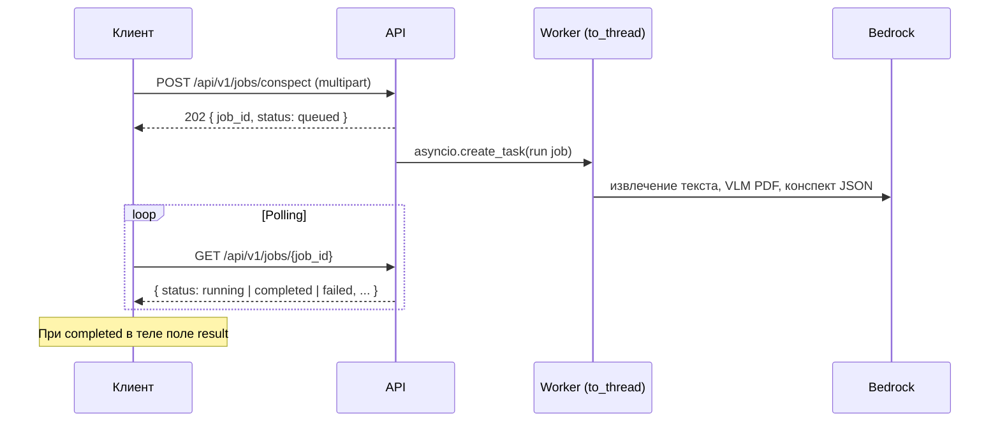

# Conspect AI — HTTP API

Сервис принимает материал урока (файл и/или текст), асинхронно строит конспект через Amazon Bedrock и отдаёт результат в виде дерева UI (JSON), ориентируясь на эталоны в `app/sample/`.

---

## Общий флоу (джобы)

Генерация **не блокирует** HTTP до конца: сначала создаётся задача, затем клиент **опрашивает статус** по `job_id`.



### Шаги для клиента

1. **Создать джоб** — `POST /api/v1/jobs/conspect` с теми же полями, что и раньше для синхронного режима (`file`, `lesson_text`, `language`).
2. Получить **`job_id`** из ответа (HTTP **202**).
3. **Опрашивать** `GET /api/v1/jobs/{job_id}` с интервалом 1–3 с (или exponential backoff), пока `status` не станет `completed` или `failed`.
4. При **`completed`** читать объект **`result`** (полный конспект). При **`failed`** — строку **`error`**.

### Статусы джоба (`status`)

| Значение   | Смысл |
|-----------|--------|
| `queued`  | Задача принята, ещё не стартовала (короткое окно). |
| `running` | Идёт извлечение текста / VLM по PDF / вызов Bedrock для JSON-конспекта. |
| `completed` | Успех: в ответе заполнено **`result`**. |
| `failed`  | Ошибка: в ответе заполнено **`error`** (текст для пользователя/логов). |

Поля **`created_at`** и **`updated_at`** — Unix time в **секундах** (float).

---

## Эндпоинты

### `GET /health`

Проверка живости.

**Ответ:** `{ "status": "ok" }`

---

### `POST /api/v1/jobs/conspect`

Создаёт джоб генерации конспекта.

- **Код:** `202 Accepted`
- **Тело:** `multipart/form-data`

| Поле          | Тип     | Обязательность | Описание |
|---------------|---------|------------------|----------|
| `file`        | файл    | нет*             | PDF, XLSX, DOCX, TXT/MD |
| `lesson_text` | string  | нет*             | Текст урока |
| `language`    | string  | нет              | `ru` \| `kz` \| `en` — язык конспекта |

\* Нужен **хотя бы один** из: `file` (непустой) или непустой `lesson_text`. Иначе `400`.

**Ответ (`ConspectJobCreateResponse`):**

```json
{
  "job_id": "550e8400-e29b-41d4-a716-446655440000",
  "status": "queued"
}
```

---

### `GET /api/v1/jobs/{job_id}`

Возвращает состояние джоба и при завершении — результат.

- **Код:** `200` — джоб найден (в том числе при `failed`).  
- **Код:** `404` — неизвестный `job_id` (истёк срок, другой инстанс без общего стора, опечатка).

**Ответ (`ConspectJobStatusResponse`):**

```json
{
  "job_id": "550e8400-e29b-41d4-a716-446655440000",
  "status": "completed",
  "created_at": 1735689600.0,
  "updated_at": 1735689625.4,
  "result": {
    "title": "…",
    "conspect_document": { "nodeType": "STACK", "children": [ … ], … },
    "source_extraction_method": "pdf_mixed",
    "extracted_char_count": 12000,
    "warnings": []
  },
  "error": null
}
```

При **`failed`:**

```json
{
  "job_id": "…",
  "status": "failed",
  "created_at": 1735689600.0,
  "updated_at": 1735689610.0,
  "result": null,
  "error": "Bedrock: …"
}
```

#### Поле `result` (`GenerateConspectResponse`)

| Поле | Тип | Описание |
|------|-----|----------|
| `title` | string | Название урока / конспекта |
| `conspect_document` | object | Корневой узел дерева UI (`nodeType`, `children`, …). Структура как в `app/sample/*.json`. Поля `id` в узлах выставляет сервер после ответа модели. |
| `source_extraction_method` | string | Например: `pdf_text`, `pdf_vlm`, `pdf_ocr`, `pdf_mixed`, `xlsx`, `docx`, `plain`, `combined` |
| `extracted_char_count` | int | Длина текста, ушедшего в модель (после склейки и обрезки лимита). |
| `warnings` | string[] | Предупреждения (например обрезка по `max_input_chars`). |

OpenAPI/Swagger: **`/docs`**, схемы моделей подтягиваются из Pydantic.

---

## Внутренняя цепочка (для понимания ошибок)

1. **Загрузка** — файл читается в память до постановки в очередь (большие PDF — учитывайте таймауты клиента на POST).
2. **Извлечение текста** — по типу файла (реестр в `app/extractors`). Для PDF: текстовый слой и/или **VLM** (Bedrock с картинками страниц) и/или OCR-fallback.
3. **Конспект** — один (или несколько при VLM по батчам страниц) вызов **Bedrock Converse**; в system prompt подмешиваются эталоны из `app/sample` (лимит символов — `CONSPECT_SAMPLE_EXAMPLES_MAX_CHARS`).
4. **Нормализация** — парсинг JSON, присвоение `id` узлам, fallback при невалидном ответе модели.

Ошибки валидации входа (пустой файл, нет ни файла ни текста) возвращаются **сразу на POST** (`400`), джоб не создаётся.

---

## Ограничения текущей реализации

- **In-memory store:** джобы живут только в процессе. Рестарт = потеря задач. Несколько реплик без sticky-сессии = **GET может не найти** `job_id`, если POST и GET попали на разные инстансы.
- Для продакшена с Lambda/несколькими подами обычно нужны **внешняя очередь** (SQS), **персистентное хранилище** (DynamoDB, Redis) и отдельный worker.

---

## Пример: `curl`

Создать джоб (файл + язык):

```bash
curl -s -X POST "http://127.0.0.1:8000/api/v1/jobs/conspect" \
  -F "file=@./lesson.pdf" \
  -F "language=ru"
```

Опрос:

```bash
curl -s "http://127.0.0.1:8000/api/v1/jobs/550e8400-e29b-41d4-a716-446655440000"
```

Только текст:

```bash
curl -s -X POST "http://127.0.0.1:8000/api/v1/jobs/conspect" \
  -F "lesson_text=Материал урока …" \
  -F "language=ru"
```

---

## Переменные окружения (кратко)

См. **`.env.example`**: Bedrock (`BEDROCK_MODEL_ID`, `BEDROCK_REGION`, …), лимиты PDF/VLM, `CONSPECT_SAMPLE_EXAMPLES_MAX_CHARS`, локальный запуск `python -m app.main`.

AWS credentials — стандартно для boto3 (`~/.aws/credentials`, переменные `AWS_*`).
